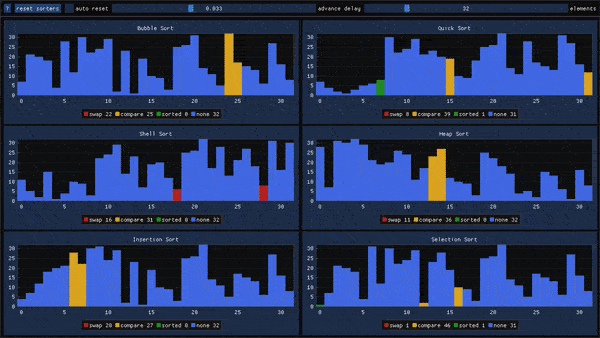

# sorting algo visualization

a visualization thingy for various sorting algorithms



## Code

- written in/with C++ 20
- uses cmake (find_package)
- only tested under Windows 10 x64

## dependencies

- GUI: [Dear IMGUI](https://github.com/ocornut/imgui) [MIT]
- Plotting: [ImPlot](https://github.com/epezent/implot) [MIT]
- Windowing: [SFML](https://github.com/SFML/SFML) [ZLIB]
- GUI binding: [ImGui-SFML](https://github.com/eliasdaler/imgui-sfml) [MIT]
- Coroutines: [CppCoro](https://github.com/lewissbaker/cppcoro) [MIT]
- Testing : [Catch2](https://github.com/catchorg/Catch2) [BSL]

### changes made to dependencies

cppcoro/generator.hpp:36:83: note: must be declared with 'noexcept'
	constexpr std::experimental::suspend_always final_suspend() const { return {}; }

## build

avaiable cmake targets:
- SortVis : user execuatable
- SortVis-test : test executable

avaiable cmake options:
- WARNINGS_AS_ERRORS
  - on by default
- ENABLE_CPPCHECK
    - off by default
- ENABLE_CLANG_TIDY
    - off by default
    - may complain about disabled exceptions due to [LLVM Bug 45356](https://bugs.llvm.org/show_bug.cgi?id=45356)
    - replace all instances of ```/EHsc``` with ```-EHsc``` in build/ as a workaround
    - should be skipped for test target